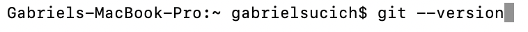
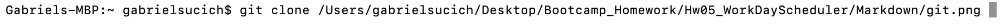
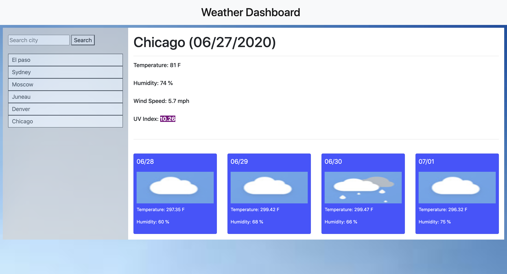

# Hw06_WeatherDashboard

The end goal of this assignment was to produce a weather dashboard that utilized the OpenWeather API to display information about current and upcoming weather in differenct cities. Upon entering a city name in the search bar, a user would be given the current date, temperature, humidity, wind speed, and UV index in that city. Additionally, a five day forecast for temperature, humidity, and general conditions was displayed below. After a user searched a city, that city was to persist in a search history bar upon closing and reopening the application.

This project foremost an introduction to the integration of APIs into website development. It's utilization of local storage, dynamic HTML updating using jQuery, and the boostrap CSS framework synthesized almost all of the material covered in class to date.

## Getting Started

These instructions will get you a copy of the project up and running on your local machine for development and testing purposes. See deployment for notes on how to deploy the project on a live system.

### Prerequisites

1. Install git by typing `git --version` in your terminal. If you are not sure if you have git or not, typing this will automatically prompt installation if you do not.

### Installing

To get access to this project for development and testing, go through the following steps:

1. Clone the project repository by navigating to a proper directory in terminal and typing `https://github.com/GabeSucich/Hw06_WeatherDashboard.git`:

2. Edit the javascript file, push to github, and see the live deployed website at the URL below.

## Built With

* [HTML](https://developer.mozilla.org/en-US/docs/Web/HTML)
* [CSS](https://developer.mozilla.org/en-US/docs/Web/CSS)
* [Bootsrap](https://getbootstrap.com/docs/4.5/getting-started/introduction/)
* [Javascript](https://developer.mozilla.org/en-US/docs/Web/JavaScript)
* [jQuery](https://developer.mozilla.org/en-US/docs/Glossary/jQuery)

## Deployed Link

* [See Live Site](https://gabesucich.github.io/Hw06_WeatherDashboard/)

## Project Snapshots

### Gabriel Sucich

- [Portfolio coming soon!](#)
- [Link to Github](https://github.com/GabeSucich)
- [Link to LinkedIn](www.linkedin.com/in/gabriel-sucich-6a28a71a8)

See also the list of [contributors](https://github.com/GabeSucich/Hw06_WeatherDashboard/contributors) who participated in this project.

## Acknowledgments

* Thanks to Trilogy Education Services, a 2U, Inc for providing framework code for this assignments.
* Big shout out to Manuel for the detailed walkthroughs of each task.